# AIRE Learning Platform: Project Structure Documentation 📚

## Chapter 1: Overview of the Project Architecture 🏗️

The AIRE Learning Platform is a web-based learning application built with Node.js and Express. It provides a platform for creating, managing, and interacting with learning modules, flashcards, and quizzes.

### Project Structure Overview

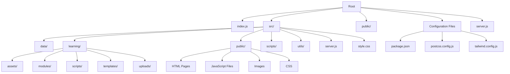

### Key Components

1. **Entry Point**: `index.js` - Imports the server configuration and starts the application
2. **Server Configuration**: `src/server.js` - Contains all Express routes and middleware
3. **Static Assets**: `src/public/` - Contains HTML, CSS, JS, and image files
4. **Learning Materials**: `src/learning/` - Houses learning modules, templates and assets
5. **Utility Scripts**: `src/scripts/` - Contains helper scripts for generation and simulation
6. **Data Storage**: `src/data/` - Stores user progress and other data

### Redundant Files

The project currently has a duplicate server file:
- `./server.js` in the root directory
- `./src/server.js` in the src directory

The root `server.js` is redundant after reorganizing the folder structure and should be removed to avoid confusion during deployment.

## Chapter 2: Application Flow and Component Relationships 🔄

### Server Initialization Flow

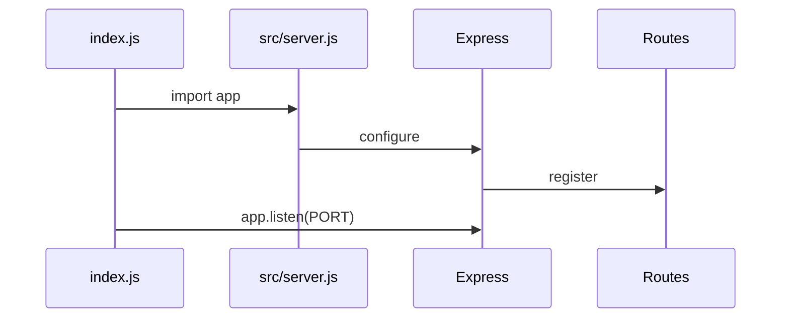

### Request Handling Flow

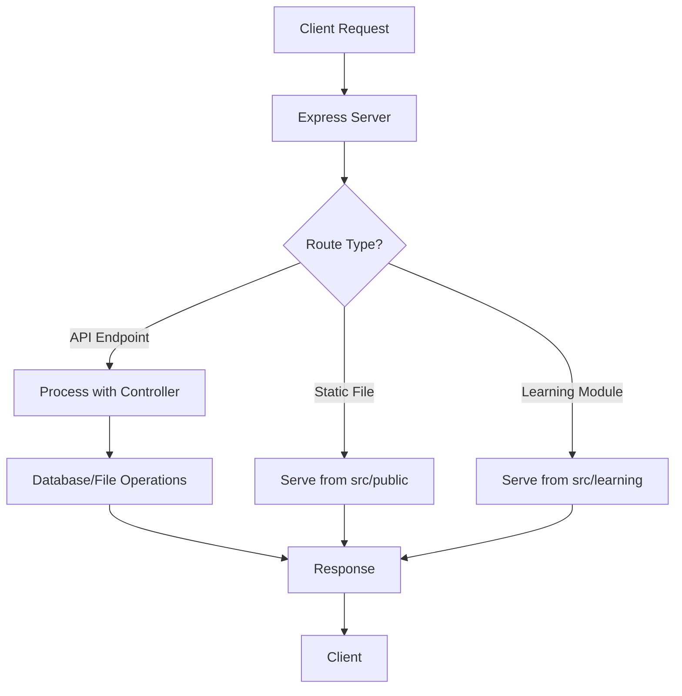

### Key Files and Their Responsibilities:

1. **index.js**: 
   - Entry point of the application
   - Imports the server configuration from `src/server.js` 
   - Starts the server on the specified port

   ```javascript
   // Main application entry point
   const app = require('./src/server');
   
   // Get port from environment variable or use default
   const PORT = process.env.NODE_PORT || process.env.PORT || 3000;
   
   // Start the server
   app.listen(PORT, () => {
     console.log(`Server running on http://localhost:${PORT}`);
   });
   ```

2. **src/server.js**:
   - Configures the Express application
   - Defines routes for static files, API endpoints, and HTML pages
   - Sets up middleware for handling JSON, file uploads, etc.
   - Exports the configured app for use in index.js
   
   ```javascript
   // Configure and export the Express app
   const express = require('express');
   const app = express();
   
   // Configure app...
   
   // Export the app for use in index.js
   module.exports = app;
   ```

3. **Root server.js**:
   - A duplicate of src/server.js with minor differences
   - Starts the server directly rather than exporting it
   - Uses absolute paths differently
   - **This is redundant and should be removed**

## Chapter 3: Learning Modules System 📝

### Learning Modules Structure

The platform uses a JSON-based structure for learning modules:

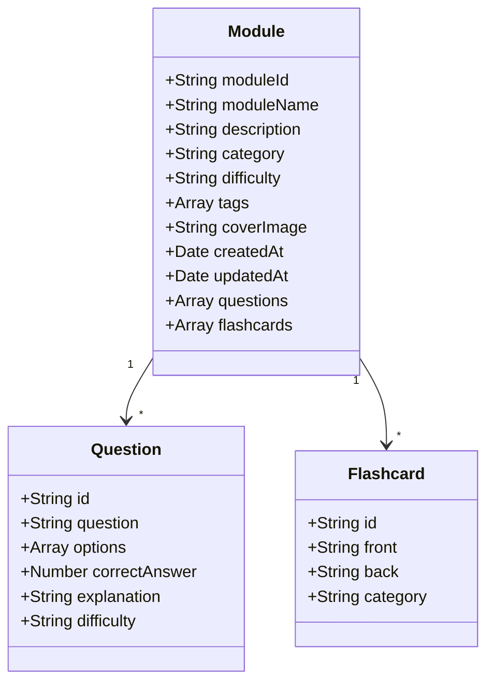

### Module Management Flow

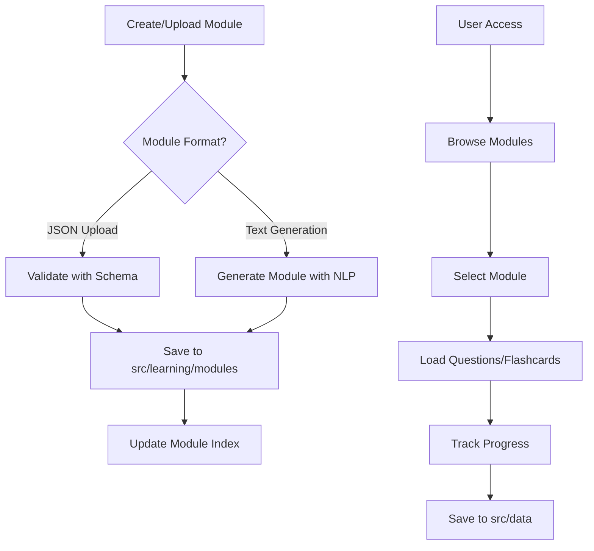

### Real Example of a Learning Module:

Here's a simplified example of a module from `src/learning/modules/js-basics.json`:

```json
{
  "moduleId": "js-basics",
  "moduleName": "JavaScript Basics",
  "description": "Learn the fundamentals of JavaScript programming",
  "category": "Programming",
  "difficulty": "beginner",
  "tags": ["javascript", "programming", "web development"],
  "createdAt": "2023-05-10T15:30:00Z",
  "updatedAt": "2023-05-15T09:45:00Z",
  "questions": [
    {
      "id": "q_1",
      "question": "What keyword is used to declare a variable in JavaScript?",
      "options": ["var", "int", "string", "declare"],
      "correctAnswer": 0,
      "explanation": "The 'var' keyword is used to declare a variable in JavaScript."
    }
  ],
  "flashcards": [
    {
      "id": "fc_1",
      "front": "What is a closure in JavaScript?",
      "back": "A closure is a function that has access to its own scope, the outer function's variables, and global variables."
    }
  ]
}
```

## Chapter 4: Tailwind CSS Integration 🎨

The project uses Tailwind CSS for styling. This is set up through several configuration files:

### CSS Processing Flow

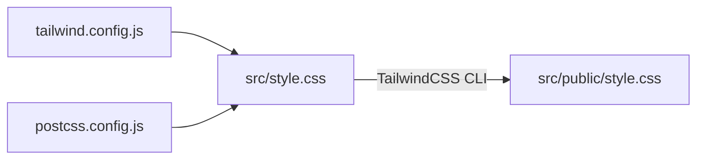

### Key Files:

1. **src/style.css**:
   - Contains the Tailwind CSS import
   - Source file for CSS processing

   ```css
   @tailwind base;
   @tailwind components;
   @tailwind utilities;

   /* Custom styles can be added here */
   ```

2. **tailwind.config.js**:
   - Configures Tailwind CSS
   - Specifies content paths for purging unused CSS
   
   ```javascript
   /** @type {import('tailwindcss').Config} */
   module.exports = {
     content: [
       './src/public/**/*.{html,js}',
       './src/**/*.{html,js}'
     ],
     theme: {
       extend: {},
     },
     plugins: [],
   }
   ```

3. **postcss.config.js**:
   - Configures PostCSS plugins
   - Integrates Tailwind CSS with the build process
   
   ```javascript
   module.exports = {
     plugins: {
       tailwindcss: {},
       autoprefixer: {},
     },
   }
   ```

4. **src/public/style.css**:
   - The compiled CSS file with all Tailwind utility classes
   - Used by HTML pages in the application

### Build Process:

The CSS build process is defined in package.json:

```json
"scripts": {
  "build": "npx tailwindcss -i ./src/style.css -o ./src/public/style.css",
  "dev": "concurrently \"NODE_PORT=4000 node index.js\" \"npx tailwindcss -i ./src/style.css -o ./src/public/style.css --watch\""
}
```

This allows for:
- One-time builds with `npm run build`
- Development mode with live reload using `npm run dev`

## Chapter 5: Development Tools and Scripts 🛠️

The project includes several useful development tools and scripts to aid in development:

### Development Scripts Overview

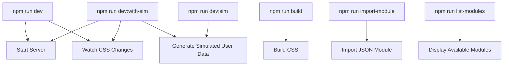

### Key Development Tools:

1. **src/scripts/dev-simulator.js**:
   - Simulates user activity
   - Generates test data for development
   
2. **src/scripts/generate-module-from-text.js**:
   - Uses natural language processing to generate learning modules from text
   - Creates questions and answers automatically
   
   ```javascript
   // Example usage
   const text = "JavaScript is a programming language used for web development.";
   const module = generateModuleFromText(text, "js-intro", "JavaScript Introduction", "Introduction to JavaScript basics");
   ```

3. **src/learning/scripts/import-module.js**:
   - Utility to import modules from JSON files
   - Validates against schema before importing

### NPM Scripts in package.json:

```json
"scripts": {
  "start": "NODE_PORT=4000 node index.js",
  "dev": "concurrently \"NODE_PORT=4000 node index.js\" \"npx tailwindcss -i ./src/style.css -o ./src/public/style.css --watch\"",
  "dev:sim": "node src/scripts/dev-simulator.js",
  "dev:with-sim": "concurrently \"NODE_PORT=4000 node index.js\" \"npx tailwindcss -i ./src/style.css -o ./src/public/style.css --watch\" \"npm run dev:sim\"",
  "build": "mkdir -p src/learning/modules && touch src/learning/modules/index.json",
  "import-module": "node src/learning/scripts/import-module.js",
  "list-modules": "node -e \"console.table(require('./src/learning/modules/index.json').modules.map(m => ({moduleId: m.moduleId, name: m.moduleName, questions: m.questionCount, flashcards: m.flashcardCount})))\""
}
```

## Chapter 6: Deployment Considerations 🚀

### Local vs. Deployment Environment

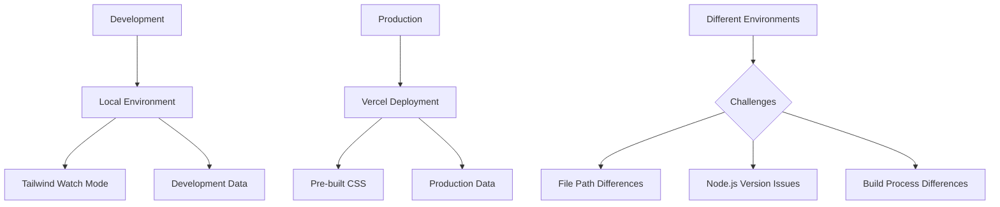

### Current Deployment Issues:

1. **Duplicate Server Files**:
   - `./server.js` and `./src/server.js` cause confusion
   - The deployment process may not know which one to use
   
2. **Node.js Version Specifications**:
   - Project requires specific Node.js version (18.x)
   - Specified in .nvmrc and package.json
   
3. **CSS Build Process**:
   - Tailwind CSS compilation can fail during deployment
   - Pre-compiled CSS should be included in the repository

### Recommended Fixes:

1. **Remove the redundant server.js**:
   ```bash
   rm ./server.js
   ```

2. **Ensure CSS is pre-built before deployment**:
   - Add a pre-deployment build step
   - Include the compiled CSS in the repository

3. **Simplify build scripts**:
   - Keep the build process minimal during deployment
   - Focus on directory creation rather than complex compilation

## Chapter 7: Future Enhancements and Recommendations 🔮

Based on the current structure, here are some recommended improvements:

### Architecture Improvements

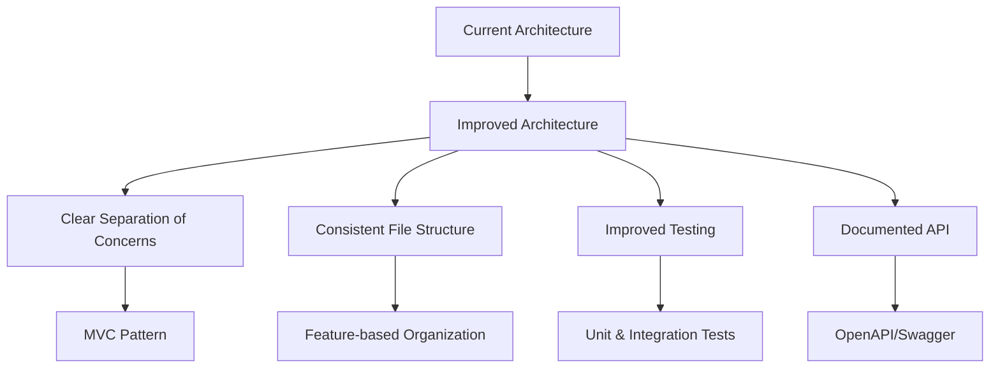

### Specific Recommendations:

1. **Adopt a More Formal Architecture**:
   - Implement Model-View-Controller (MVC) pattern
   - Separate business logic from routes
   
   ```
   src/
     ├── controllers/
     ├── models/
     ├── routes/
     ├── views/
     └── middleware/
   ```

2. **Improve Error Handling**:
   - Implement global error handling middleware
   - Add structured logging
   
3. **Add Comprehensive Testing**:
   - Add unit tests for utilities and business logic
   - Add integration tests for API endpoints
   - Add end-to-end tests for critical user flows
   
4. **Enhance Documentation**:
   - Add JSDoc comments to functions
   - Create API documentation with Swagger/OpenAPI
   - Include a developer guide

5. **Security Enhancements**:
   - Implement proper authentication/authorization
   - Add input validation on all endpoints
   - Add rate limiting for API endpoints

## Addendum: Node.js Version and Project Structure Updates 🔄

### Node.js Version Considerations

For the AIRE Learning Platform, we are now using Node.js 22.x as specified in the `.nvmrc` file and package.json. We've upgraded to Node.js 22 for the following benefits:

1. **Latest Features**: Access to the newest JavaScript language features
2. **Performance Improvements**: Better performance and memory management
3. **Security Updates**: Latest security patches and improvements

Vercel has good support for Node.js 22, making it a good choice for our deployment platform.

### Package.json Structure

We have removed the redundant package.json from the root directory. The only package.json we need is located at:
```
/Users/markcarpenter/aiteacher/AIRE_LEARNING_PLATFORM/study-game/package.json
```

This simplifies our project structure and avoids confusion during deployment.

### Vercel Deployment Path

For Vercel auto-deployment from GitHub, the configuration is correctly set to use:
```
/AIRE_LEARNING_PLATFORM/study-game
```

This means:
- Vercel will look for the entry point (index.js) in this directory
- It will use the package.json in this directory for dependencies and scripts
- The build commands defined in this package.json will be executed during deployment

### Current Project Structure After Cleanup

After removing the redundant server.js file from the root directory and the redundant package.json, our project structure is now cleaner:

```
AIRE_LEARNING_PLATFORM/study-game/
├── index.js                # Entry point - imports and starts the server
├── package.json            # Dependencies and scripts
├── package-lock.json       # Exact dependency versions
├── .nvmrc                  # Node version specification (22.x)
├── postcss.config.js       # PostCSS configuration
├── tailwind.config.js      # Tailwind CSS configuration
├── public/                 # Public assets (compiled CSS)
└── src/                    # Source code
    ├── server.js           # Express server configuration
    ├── style.css           # Source CSS with Tailwind imports
    ├── data/               # User progress data
    ├── learning/           # Learning modules and assets
    ├── public/             # Static HTML, JS, and assets
    ├── scripts/            # Utility scripts
    └── utils/              # Helper utilities
```

This structure ensures a clean separation of concerns and is well-suited for deployment on Vercel.

## Chapter 8: Vercel Deployment Best Practices and Troubleshooting 🚢

When deploying the AIRE Learning Platform to Vercel, there are several important considerations to ensure a smooth deployment process.

### Key Issues and Solutions

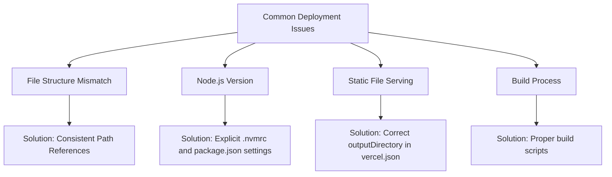

### File Structure Considerations

The project has the following important directory structure:

```
AIRE_LEARNING_PLATFORM/study-game/
├── index.js                # Main entry point that uses Express
├── src/
│   ├── server.js           # Express app configuration
│   ├── public/             # Static assets served by Express
│   │   ├── index.html      # Main application page
│   │   ├── style.css       # Compiled styles
│   │   ├── js/             # JavaScript files
│   │   └── ...             # Other static assets
│   └── ...                 # Other application code
```

The key insight is that the `src/public` directory contains our static files, not the `public` directory at the project root. This is crucial for Vercel deployment configuration.

### Vercel Configuration

For Node.js Express applications, the proper `vercel.json` configuration should point to the correct static assets directory:

```json
{
  "version": 2,
  "functions": {
    "api/**/*.js": {
      "runtime": "nodejs22.x"
    },
    "index.js": {
      "runtime": "nodejs22.x"
    }
  },
  "outputDirectory": "src/public",
  "public": true,
  "rewrites": [
    { "source": "/(.*)", "destination": "/index.js" }
  ]
}
```

The critical settings are:
1. **outputDirectory**: Points to `src/public` where our static files are located
2. **runtime**: Uses `nodejs22.x` as specified in our `.nvmrc` file
3. **rewrites**: Routes all requests through the Express application via `index.js`

### Entry Point for Vercel

The `index.js` file has been modified to support both local development and Vercel deployment:

```javascript
// Main application entry point
const app = require('./src/server');

// Get port from environment variable or use default
const PORT = process.env.NODE_PORT || process.env.PORT || 3000;

// For Vercel serverless deployment
if (process.env.VERCEL) {
  // Export the Express app for Vercel serverless functions
  module.exports = app;
} else {
  // Start the server for local development
  app.listen(PORT, () => {
    console.log(`Server running on http://localhost:${PORT}`);
  });
}
```

This conditional export allows Vercel to use the Express app as a serverless function while still supporting traditional server startup for local development.

### Common Deployment Issues and Solutions

| Issue | Solution |
|-------|----------|
| 404 errors | Ensure `outputDirectory` in vercel.json points to `src/public` |
| Build failures | Check that build scripts create necessary directories |
| Node.js version mismatch | Update `.nvmrc` and `engines` in package.json to use `22.x` |
| API routes not working | Use proper rewrites in vercel.json to route through index.js |
| Static assets not found | Check that Express is serving from the correct directory |

### Best Practices for Vercel Deployment

1. **Consistent paths**: Use relative paths in your server code for file operations
2. **Environment variables**: Use Vercel's environment variable system for sensitive information
3. **Build steps**: Keep build steps minimal and focused on directory creation
4. **Testing**: Test locally with `vercel dev` before deploying
5. **Monitoring**: Use Vercel's logs to diagnose deployment issues

By following these guidelines, the AIRE Learning Platform can be successfully deployed to Vercel and serve both its static content and API endpoints properly.

---

## Is there a specific aspect of the project structure that you'd like me to explain in more detail? 🤔

I can further explore any of these topics or provide more concrete examples of the code if needed. Would you like me to dive deeper into:

1. The learning module generation system?
2. The Express server configuration?
3. The CSS/Tailwind setup?
4. The development tools?
5. Deployment strategies for Vercel?

Or is there something else you'd like to know about how the project is structured? 

## Chapter 10: In-Browser Documentation Access 📖

For developer convenience, the AIRE Learning Platform includes a browser-based documentation viewer. This feature allows you to view all markdown documentation as nicely formatted HTML directly in your browser.

### Accessing Documentation in the Browser

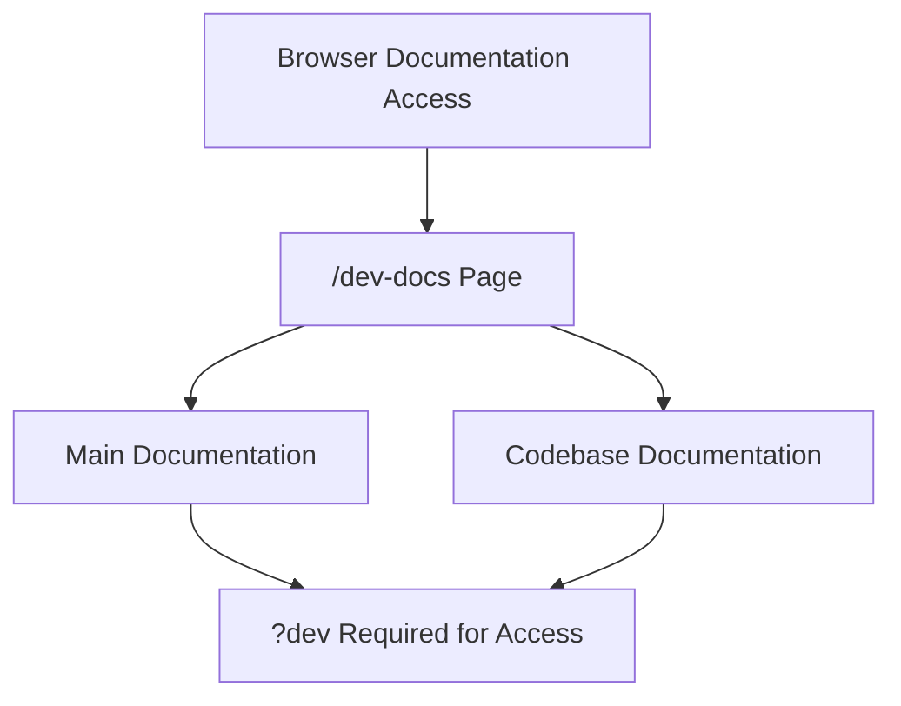

To access the documentation in your browser:

1. Start the development server with `npm run dev`
2. Visit `http://localhost:4000/dev-docs` in your browser
3. From there, you can access:
   - The main project documentation (`/docs/AIRE_LEARNING_PLATFORM-documentation?dev`)
   - The comprehensive codebase documentation (`/docs/AIRE_LEARNING_PLATFORM-codebase?dev`)

### Security Considerations

The documentation feature is restricted to development use only and requires the `?dev` parameter to be present in the URL. This prevents unauthorized access in production environments.

### Implementation Details

The documentation browser is implemented using:

- The `marked` package to convert markdown to HTML
- A dedicated `/docs/:file?` endpoint in server.js
- Custom styling to present the documentation in a readable format

This feature makes it easy to access and review documentation while working on the project, without having to switch to a separate markdown viewer. 